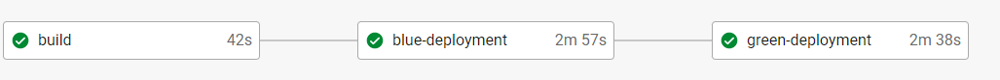
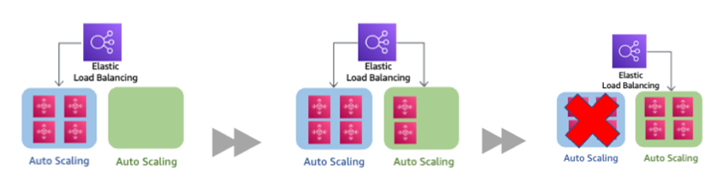

# Udgram Backend

## Pipeline status: 

## Required Environment Variables
| Environment Variable        | Description                                                                      |
|         :-:                 |     :-:                                                                          |
| FRONTEND_BUCKET_NAME        | Frontend bucket name (from cloudformation outputs `FrontEndBucket`)              | 
| DatabaseSecretName          | Secret Name in Secret Manager (from cloudformation outputs `DatabaseSecretName`) |
| POSTGRES_HOST               | Database Host (from cloudformation outputs `DatabaseEndpoint`)                   |
| POSTGRES_USERNAME           | Database Username (Automatticaly added to ansible)                               |
| POSTGRES_PASSWORD           | Database Password (Automatticaly added to ansible)                               |
| POSTGRES_DB                 | Database Name  `postgres`                                                        |
| PORT                        | Port the host the backend MUST BE: `80`                                          |
| JWT_SECRET                  | Random text to create the secret                                                 |
| ANSIBLE_HOST_KEY_CHECKING   | Disable ansible host checking MUST BE: `False`                                   |

## Add SSH keys to CircleCi
1) Go to project setting
2) Add ec2acc.pem and backendprivate.pem to ssh keys without hostname
3) Modify the fingerprints values in `.circleci\config.yml`

Backend 
Features:
-	Fully configured by Ansible:
    -	Create a dynamic inventory that contains EC2 instances inside the Auto Scaling Group.
        -	The ASG is spinning up and terminating EC2 instances all the time so we don’t have constant private DNS names, so we fetch them dynamically
    -	Get the Bastion Host public DNS name dynamically, so it’s never need to even check it manually
    -	Gets the Database username and password automatically from the Secrets Manager
    -	Updates the backend servers configuration and run the service

-	Blue/Green Deployment Strategy:
    -	The strategy is implemented by swapping the Auto Scaling Group behind the Elastic Load Balancer
    -	Steps:
        -	Create a new Auto Scaling Group(Blue) with the same Launch Configuration and Target Group
        -	Attach the Blue ASG to the Load Balancer
        -	Ansible deploys the new app version to the Blue ASG ( At this point the traffic is sent to both Blue healthy instances and all Green) 
            -	The instance is healthy if the instance is up and running and dealing with requests
            -	If there are no Healthy Blue ASG instances the CI/CD fails and Green won’t be affected.
            -	If there are Healthy Blue ASG instances the pipeline keeps checking for unhealthy instances for a specific period of time. Once there are no more unhealthy instances the Green-Deployment begins
        -	The Green-Deployment deletes the Green ASG then marks the Blue ASG as the new Green ASG
        -	Bash & Python Scripts are used along the process

